# Concurrent Programming Project in Python

_Practical work and project in python in the CS-PC module at CPE Lyon. The topic of this course is concurrent programming (on ubutnu 18.04)._

### authors :
- **Theotime P** [Theotime P](https://github.com/TheoTime01)
- **Mathis G**  [Mathis G](https://github.com/MaaatGrv)

## Table of Contents
- [Concurrent Programming Project in Python](#concurrent-programming-project-in-python)
    - [authors :](#authors-)
  - [Table of Contents](#table-of-contents)
  - [I/ Introduction :](#i-introduction-)
  - [II/ Topics :](#ii-topics-)
    - [Log Manager](#log-manager)
    - [Temperature and pressure controller](#temperature-and-pressure-controller)
    - [Horse race](#horse-race)
    - [Game of Life](#game-of-life)
    - [Simulation of a restaurant](#simulation-of-a-restaurant)
    - [Quick sort](#quick-sort)
    - [Exercise: do some calculations](#exercise-do-some-calculations)
    - [Pi calculation with parallel process](#pi-calculation-with-parallel-process)
  - [References](#references)

## I/ Introduction :
Within this project, you will be able to see the realizations that the authors were able to realize during the TP sessions allocated as well as during their free time. 8 subjects were treated for the realization of this project which are :
- Horse race
- Marbles manager
- Estimation of PI
- Exercise: make calculations
- Quick Sort
- Game of Life
- Restaurant Simulation
- Temperature and pressure controller

The objective of these files was to transpose or create the programs described in the specifications by using parallelism and by using the python multiprocessing library.

## II/ Topics :

### Log Manager

In this exercise, the goal was to make limited resources available to processes that use these resources. If a process does not have enough resources to work then it waits for them to become available again after the resources to work then it waits for them to become available again after a process has finished process that returns its resources once its task has been completed. For this, 4 processes a are launched and perform a task 4 times, each using a different number of resources. Moreover, a controller checks that the number of available balls does not exceed the number of balls available at the beginning.

We can thus observe the actions of the various processes in detail.

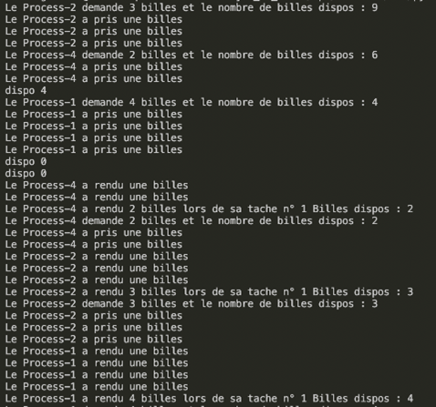

### Temperature and pressure controller
  
The aim of this exercise was to set up a multi-task system. Different processes are started, one for temperature, one for pressure. These processes read and convert the values of the sensors so that the screen (other process) can make the display of the display of the pressure and the temperature. A last process serves as a controller and manages the action of the heater and the pump according to the feedbacks provided by the sensors in parallel. The display given by this function is not very interesting because no sensor modifies the pressure and temperature values.

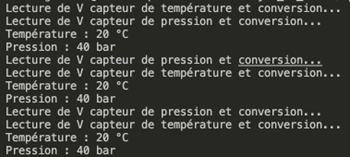

### Horse race
  
In this exercise, we try to realize a referee who displays permanently the horse which is in the lead as well as the one that is last in a horse race, and that at the end of the race displays the winner. The display is realized without graphic interface, but by erasing and
rewriting text. In our case, we chose to put emojis to have more realism with a letter realism with a letter dedicated to each to differentiate them.

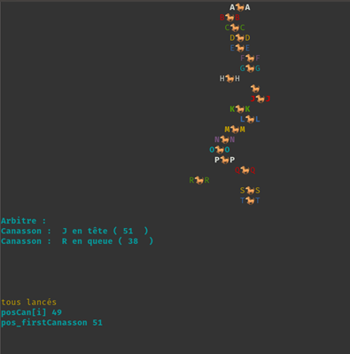

### Game of Life
  
This is a grid whose boxes represent either a living "being" or nothing. The state of a cell can be modified according to its neighborhood according to the rules described below:
  - Any living cell with less than two living neighbors dies, as if it were due to a subpopulation.
  - Any living cell with two or three living neighbors lives to the next generation.
  - Any living cell with more than three living neighbors dies, as if due to to overpopulation.
  - Any dead cell with exactly three living neighbors becomes a living cell, as if by reproduction.

The purpose of this exercise is to make a competing version of this game (with the same mechanisms as the horse race).

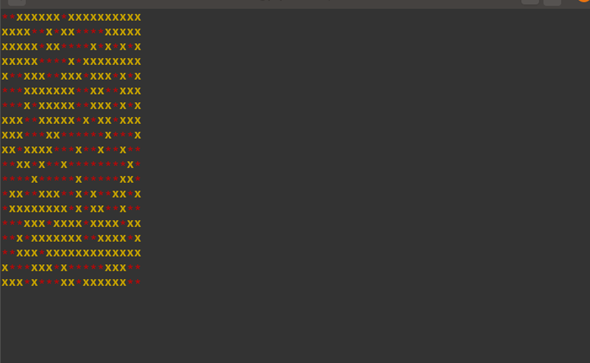

Living cells are shown in red and dead cells in yellow.

### Simulation of a restaurant

In this subject, we want to simulate in real time the following:

1. simulate customer orders in a restaurant
2. a number of waiters in the dining room register these orders and transmit them to the to the kitchen for preparation
3. after their preparation, the waiters deliver these orders to the customers

To do this, use 3 processes, Customer processes, Waiters processes and a process Major d'homme.

The display of information will be exclusively managed by the Major d'homme. It will display:

- customer orders (pairs (id, menu)) as soon as they are issued
- the server that takes this order in charge and simulates its preparation (by a delay)
- the customer who receives his prepared order

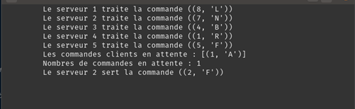

### Quick sort
  
In this exercise, we have to sort a list according to the following method:

To sort an array T of N elements,
- Designate a value of the array (called the Pivot p)
- Split T into two sub-arrays T1 and T2 such that the values of T1 are ≤ p and those of T2 are > p
- Sort T1 and T2
- Reconstitute T by placing T1 then p then T2

The pivot is the first element of the array.
Each Process subcontracts to a child process the half of the array assigned to it and and takes care of the other half itself.
We generate an array randomly and then sort it.

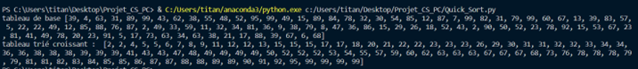

### Exercise: do some calculations

In this topic, we realize an exchange between a requesting client and a computing server. We have m requesters and n calculators, so when the result is calculated and deposited in the Queue by a calculator process, it adds to it the identifier of the requester. Thus, the
requester can filter the Queue of results to find the answers to his requests.

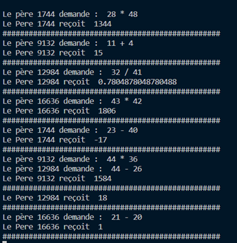

### Pi calculation with parallel process

In this script, we have adapted the pi calculation function by the arctan so that several processes compute a number of partitions distributed on each process. The sum of the partitions calculated in parallel gives pi. 

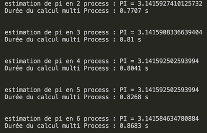

The interest here is to study the efficiency in terms of speed of execution of such a calculation as a function of the number of processes in parallel and the number N of partitions of pi. We have therefore carried out tests for N= $10^6$ , $10^7$ and $10^8$ :

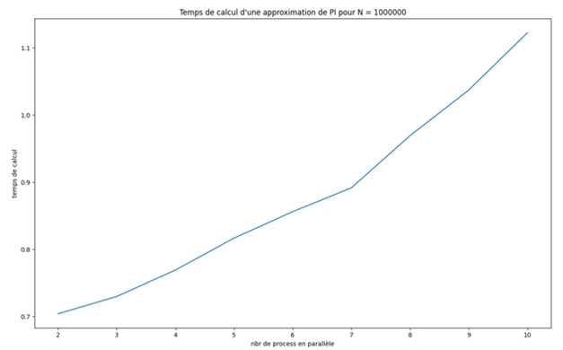

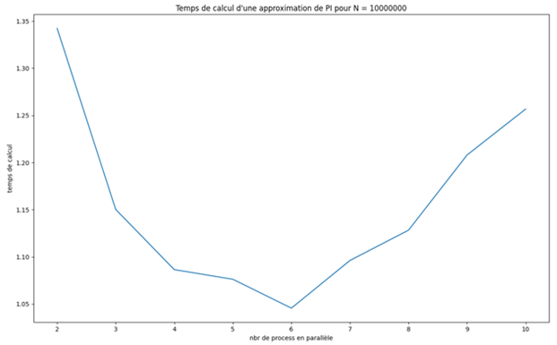

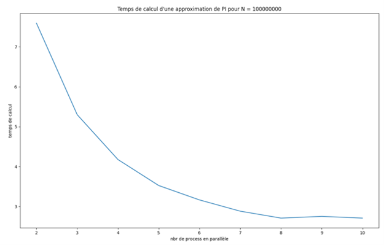

The graphs show the importance of the choice of the number of processes to run in parallel to to run in parallel to perform certain tasks. The greater the number of iterations the more interesting it becomes to run processes in parallel. 

However, in the case where N= $10^7$, we notice that the calculation of pi is faster for n=6 processes in parallel. This shows that it is not always interesting to choose a large number of processes to run in number of processes to run in parallel, it is necessary to make compromises.

## References

- https://docs.python.org/3/library/multiprocessing.html
- https://github.com/AxFrancois/PC-ProgrammationConcurrente.git